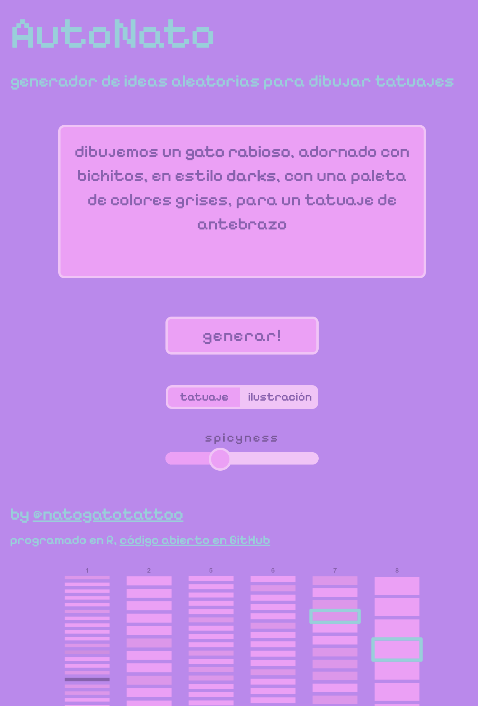

# Auto Nato Gato Tattoo

Pequeña web app que genera ideas o _prompts_ que te ayuden a inspirarte para hacer ilustraciones, dibujos y tatuajes.

Los textos se generan a partir de la selección aleatoria de términos (o _tokens_), organizados en distintos conjuntos, cuyos elementos poseen distintos pesos que alteran sus probabilidades de ser seleccionados bajo distintas condiciones.

Los conjuntos principales de términos son: ideas (separados en conjuntos temáticos), paletas de colores, objetos, adjetivos, tamaños, entre otros. 

Funciona como app web a la que puedes [acceder por este enlace](https://bastianoleah.shinyapps.io/autonatotattoo/). La app contiene pocas opciones: una para eliminar términos específicos para tatuadores (que son irrelevantes para ilustradores, por ejemplo), y otra que aumenta el nivel de _spicyness,_ al aumentar las probabilidades de ciertos términos, o bien habilitar nuevos conjuntos de términos más caóticos.

La aplicación se programó en R, utilizando en su mayoría R-base, hasta que se me ocurrió agregar un gráfico que ilustra la selección aleatoria de términos, lo que significó agregar dependencias a `{dplyr}` y `{ggplot2}`. El funcionamiento como web app es gracias a `{shiny}`, con tipografías de Google Fonts usando `{fresh}`.

La app está [disponible en este enlace](https://bastianoleah.shinyapps.io/autonatotattoo/), hosteado en shinyapps.io.

Sigan a [@NatoGatoTattoo](https://www.instagram.com/natogatotattoo/), la tatuadora detrás de la idea <3

